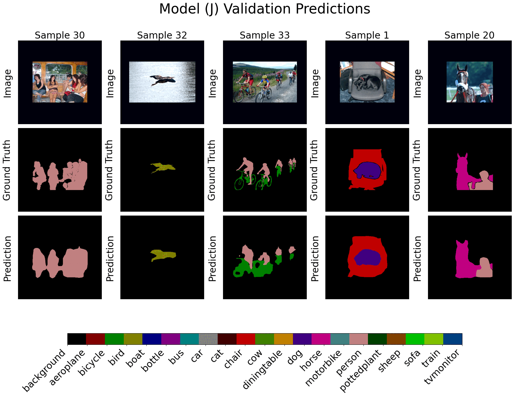

# ICS 635 Final Project

All code is released under a CC-BY-NC-SA license

> Leveraging transformers for image segmentation



## Features

- Train models on PascaL VOC dataset
- Run ablations on many parameters
- Store all results to a file

## Getting Started

This project uses python 3.11 and any environment with a gpu installed


### Installation

```bash
pip install -r requirements.txt
```

### Usage

Update the config in the train.py file and run 

```bash
!mkdir data
python3 train.py
```

If you want to run the 2012 Pascal VOC training data please go to data folder and replace the ImageSets/Segmentation folder with our Segmentation folder provided here. 

To inspect your results, go to the Visualize Logs notebook
```
jupyter notebook
```

## Credits

This code was a re-implementation of the Dense Prediction Transformer. Also some code from torchvision, torch, and transformers was used to make this repo.  
